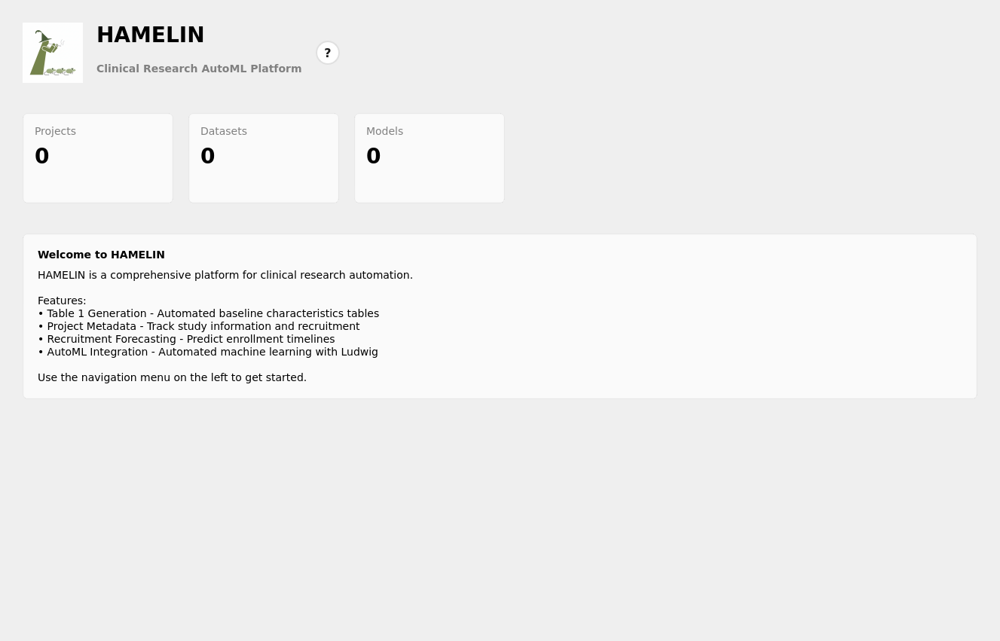
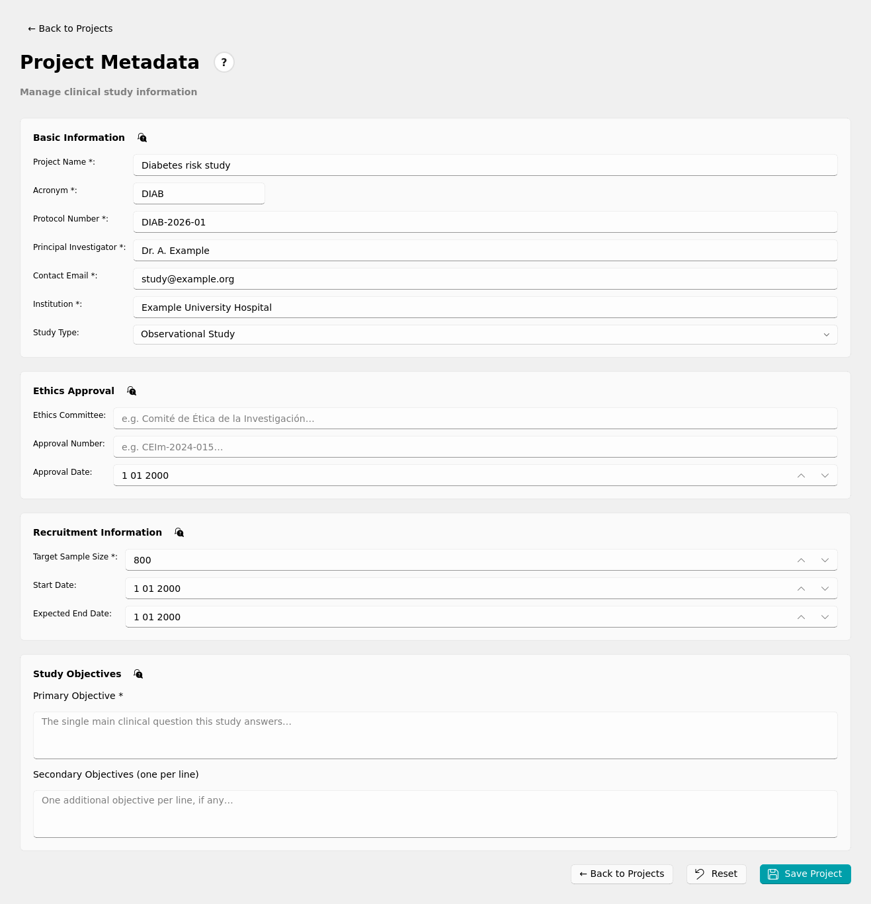
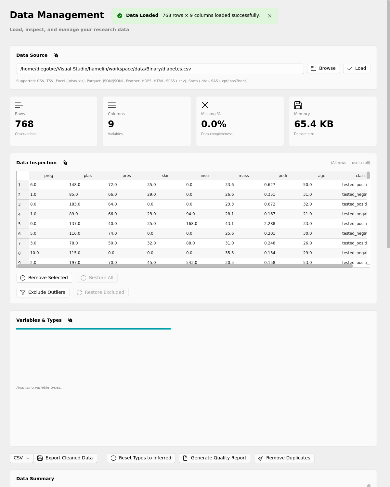
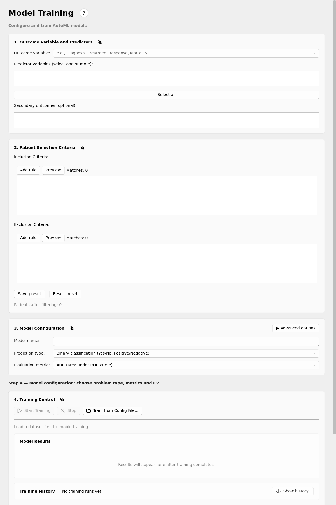
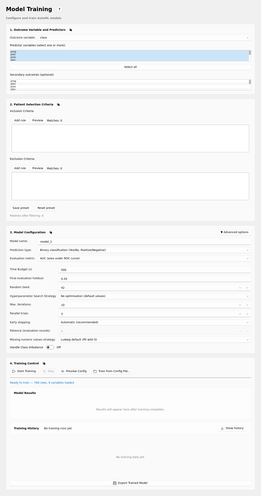
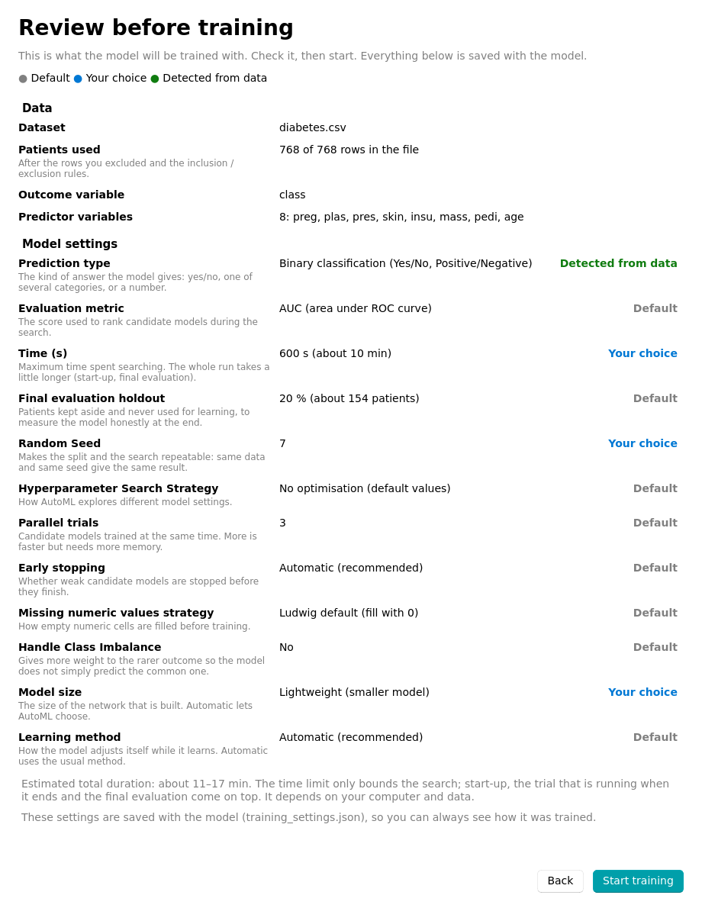
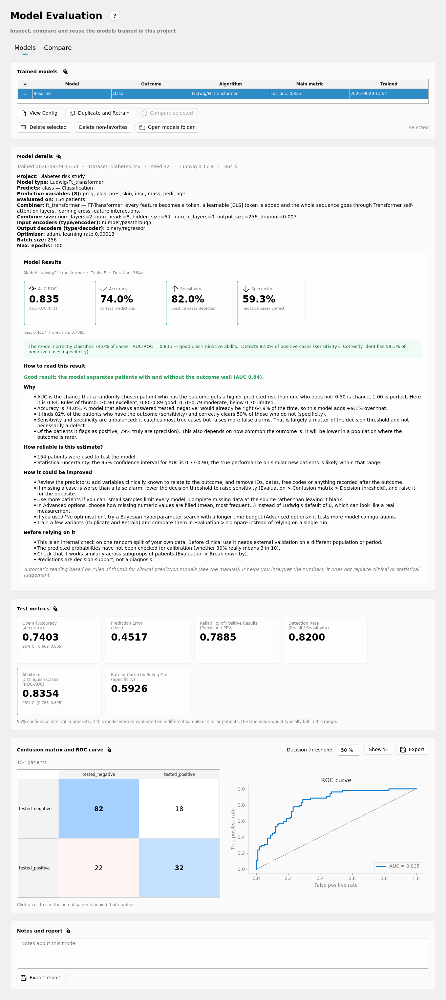
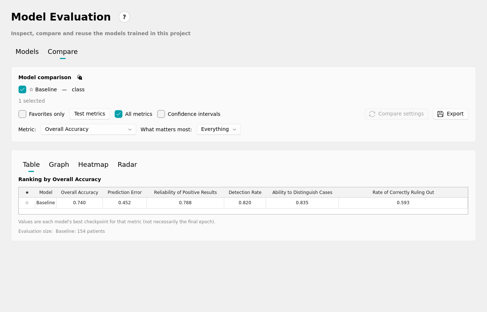

# Hamelin

[](https://doi.org/10.5281/zenodo.23128034)

**Human-guided Automated Machine Learning for Clinical Studies.** Desktop application for building, evaluating and using machine-learning models on clinical and tabular data — no programming required.

Hamelin guides you from a spreadsheet to a trained, evaluated and documented predictive model. It is built on [Ludwig](https://ludwig.ai) (declarative deep learning) and [Ray Tune](https://docs.ray.io/en/latest/tune/) for automatic hyperparameter search, and wraps them in a native desktop interface designed for researchers and clinicians: every step is explained in plain language, every result comes with its uncertainty, and everything a study produces is stored together in one project folder.

<p align="center">
  
</p>

## Contents

- [Design principles](#design-principles)
- [Features](#features)
- [Requirements](#requirements)
- [Installation](#installation)
- [Starting the application](#starting-the-application)
- [Basic workflow](#basic-workflow)
- [Screenshots](#screenshots)
- [Projects, configuration and generated models](#projects-configuration-and-generated-models)
- [Standalone executable](#standalone-executable)
- [Documentation](#documentation)
- [References](#references)
- [Development](#development)
- [Authors](#authors)
- [License](#license)

## Design principles

Hamelin follows the principles of **Human-Centered Artificial Intelligence (HCAI)**, and its workflow applies **Human-Guided Machine Learning (HGML)**. They work at different levels:

- **HCAI** is a framework for designing and governing AI systems. As proposed by Ben Shneiderman [[1]](#references), it rests on two independent axes, **human control** and **computer automation**, and asks for *both at a high level* so that the system is reliable, safe and trustworthy. It defines the properties of the system as a whole: transparency, visible uncertainty, traceability, accountability and human oversight.
- **HGML** [[2]](#references) is an approach within the machine-learning process itself: the domain expert takes part in the workflow, choosing the variables, constraints and criteria that guide the search and validating the outcome. In Hamelin this is the researcher choosing the outcome, the predictors, the patient selection rules and the training limits, while AutoML searches within those decisions.

HGML is one way of achieving the human-control axis of HCAI inside the learning cycle; HCAI goes further, also requiring transparency, auditability and accountability around it.

**High automation.** Hamelin automates what is technical and tedious: variable-type detection, model and architecture selection, hyperparameter search (AutoML with Ludwig and Ray Tune), evaluation with confidence intervals, and a plain-language reading of every result.

**High human control.** The person stays in charge, informed and accountable:

- **The human guides the process.** The researcher chooses the outcome, the predictors, the patient selection rules and the training limits; the automation only searches within those choices. Nothing irreversible happens silently: data are hidden rather than deleted, and the original file is never modified.
- **Transparency and explainability.** Every field has a plain-language explanation. Each result includes a rule-based "How to read this result" (explicit thresholds, reproducible and auditable, not another black box) that says whether the result is good, moderate or weak, why, and how to improve it. The architecture chosen by AutoML is shown and described.
- **Uncertainty and limits made visible.** Metrics come with 95 % confidence intervals, small test sets and overfitting are flagged, and the tool states its limits: internal validation only, calibration not checked, subgroups to review, decision support and not diagnosis.
- **Traceability and accountability.** Each model stores the exact configuration, settings, software versions, seed and the dated record of every change made to the data, so any result can be reproduced and audited.
- **Room to intervene.** The decision threshold can be explored, the individual patients behind each prediction can be inspected, and performance can be broken down by subgroup.
- **Privacy by design.** Everything runs locally; no data leave the computer.
- **Usability for non-programmers.** A guided workflow, clear messages and errors, sensible defaults and live feedback, with the interface in English and Spanish.

## Features

- **Projects.** One folder per study, holding the study description (protocol, institution, objectives), its datasets and every result generated from them.
- **Data import and exploration.** CSV, TSV, Excel, JSON, Parquet, Feather, Stata, SAS, SPSS and other formats supported by Ludwig; preview, variable-type detection, missing-value and outlier handling, and descriptive statistics ("Table 1").
- **Automatic model training.** Classification (binary and multiclass) and regression with Ludwig AutoML: choose the outcome, the predictor variables and a time limit, and Hamelin searches for a good architecture and hyperparameters. Advanced controls cover the metric to optimise, parallel trials, maximum iterations, a fixed random seed for reproducibility and a professional early-stopping policy (automatic, fixed patience, or off).
- **Rigorous evaluation.** Metrics on a held-out test set with 95 % bootstrap confidence intervals, confusion matrix with adjustable decision threshold and patient drill-down, ROC curve, per-subgroup breakdown, and a rule-based plain-language reading of every result ("How to read this result"), including reliability, limitations and suggestions for improvement.
- **Model comparison.** Rank several models as a table, bars, heat map or radar chart, mark favourites and see which settings differ between two models.
- **Export.** Charts (PNG/PDF), tables (CSV), model reports (CSV/PDF) and predictions, all saved inside the project.
- **Traceability.** Every model stores its exact configuration, training settings, software versions, seed and notes — and the dated record of every change made to the dataset (rows or columns removed, outliers excluded, types overridden). The original data file is never modified.
- **English and Spanish interface**, light and dark themes, built-in help.

## Requirements

- Python **3.12** or newer.
- [uv](https://docs.astral.sh/uv/) (recommended) or `pip`.
- Windows, Linux or macOS with a desktop environment.
- 8 GB of RAM or more recommended. A CUDA-capable NVIDIA GPU is optional: Hamelin falls back to the CPU automatically when the GPU is missing or unsupported.

## Installation

```bash
git clone https://github.com/diegotxegp/hamelin.git
cd hamelin
uv sync
```

Without uv, create a virtual environment and install from the pinned requirements:

```bash
python -m venv .venv
source .venv/bin/activate          # Windows: .venv\Scripts\activate
pip install -r requirements.txt
pip install -e .
```

## Starting the application

```bash
uv run hamelin
```

or, inside an activated environment:

```bash
hamelin
```

The window opens at a size that fits your screen and remembers its size and position between sessions.

## Basic workflow

1. **Create or open a project** (*Project*). Give it a name and describe the study; Hamelin creates the project folder.
2. **Load a dataset** (*Data*). Import your file, check the detected variable types, clean missing values and outliers, and generate the descriptive table.
3. **Train a model** (*Training*). Pick the variable to predict and the predictors, set a time limit (and, optionally, the advanced settings), and start. Before it starts, a summary shows every setting that will be used (defaults and your own choices, each explained). Progress and the best configuration found so far are shown while it runs.
4. **Evaluate** (*Evaluation*). Inspect metrics with confidence intervals, the confusion matrix and ROC curve, read the plain-language interpretation, compare models and add notes.
5. **Export.** Save charts (PNG/PDF), tables (CSV/Excel/Word) and model reports from each page into the project's `results/` folder.

The built-in **Help** page explains each screen in detail.

## Screenshots

| | |
|---|---|
|  **Project** |  **Data** |
|  **Training** |  **Advanced training settings** |
|  **Review before training** |  **Evaluation** |
|  **Model comparison** | |

## Projects, configuration and generated models

Hamelin keeps its data in a `workspace/` folder:

```text
workspace/
├── config/           application settings (language, theme, window size, defaults)
├── logs/             application logs (rotated automatically)
└── Projects/
    └── <PROJECT>/
        ├── metadata.json          study description
        ├── model_history.json     index of the trained models
        ├── data/                  the project's datasets and their change records (<dataset>.changes.json)
        └── results/
            ├── models/<model>/    one folder per trained model
            ├── tables/            exported tables
            ├── reports/           exported reports
            └── forecasts/, predictions/   exports of those pages
```

Folders appear only when something is first saved into them (a new project holds just `data/`); empty ones are removed when a project is opened or the app is closed, and Ludwig's temporary trial files are deleted after every training run.

Everything generated for a project stays inside that project's folder, so a project can be archived or shared by copying its directory.

Each trained model folder contains:

| File | Content |
|---|---|
| `model/` (weights) | The trained network, reloadable by Ludwig |
| `model_hyperparameters.json` | The full Ludwig configuration that produced the model |
| `training_settings.json` | The settings chosen on the Training page (time limit, seed, early stopping, …) |
| `training_report.json` | Metrics, data schema, software versions and seed |
| `data_changes.json` | The changes made to the dataset on the Data page when the model was trained |
| `test_predictions.csv` | Predictions for the held-out test set |
| `notes.txt` | Your notes about the model (if any) |

Application-wide settings are stored in `workspace/config/app_config.yaml` and can be changed from the **Settings** page.

## Standalone executable

A prebuilt Linux x86-64 executable (no Python needed, CPU only) can be downloaded from the [Releases page](https://github.com/diegotxegp/hamelin/releases). You can also build one yourself with PyInstaller. See [Building and moving the standalone executable](docs/hamelin/DISTRIBUTION.md) for the build steps and for running it on a virtual machine.

## Documentation

- The in-app **Help** page.
- [User manual](docs/hamelin/MANUAL.md), with a description of every screen.
- [Changelog](CHANGELOG.md) and [how to make a release](docs/hamelin/RELEASING.md).
- [Ludwig documentation](https://ludwig.ai/latest/) for the underlying configuration options.

## References

1. Shneiderman, B. (2022). *Human-centered AI*. Oxford University Press.
2. Gil, Y., Honaker, J., Gupta, S., Ma, Y., D'Orazio, V., Garijo, D., ... & Jahanshad, N. (2019, March). Towards human-guided machine learning. In *Proceedings of the 24th international conference on intelligent user interfaces* (pp. 614-624).

## Development

```bash
uv sync --group dev
```

A standalone executable can be built with PyInstaller using the provided `hamelin.spec`.

## Authors

- **Diego García-Prieto** — University of Cantabria — <diego.garciaprieto@unican.es>
- **Camilo Palazuelos** — University of Cantabria — <camilo.palazuelos@unican.es>
- **Rafael Duque** — University of Cantabria — <rafael.duque@unican.es>

## License

Hamelin is free software released under the [GNU General Public License v3.0](LICENSE). You may redistribute and modify it under the terms of the GPLv3.
