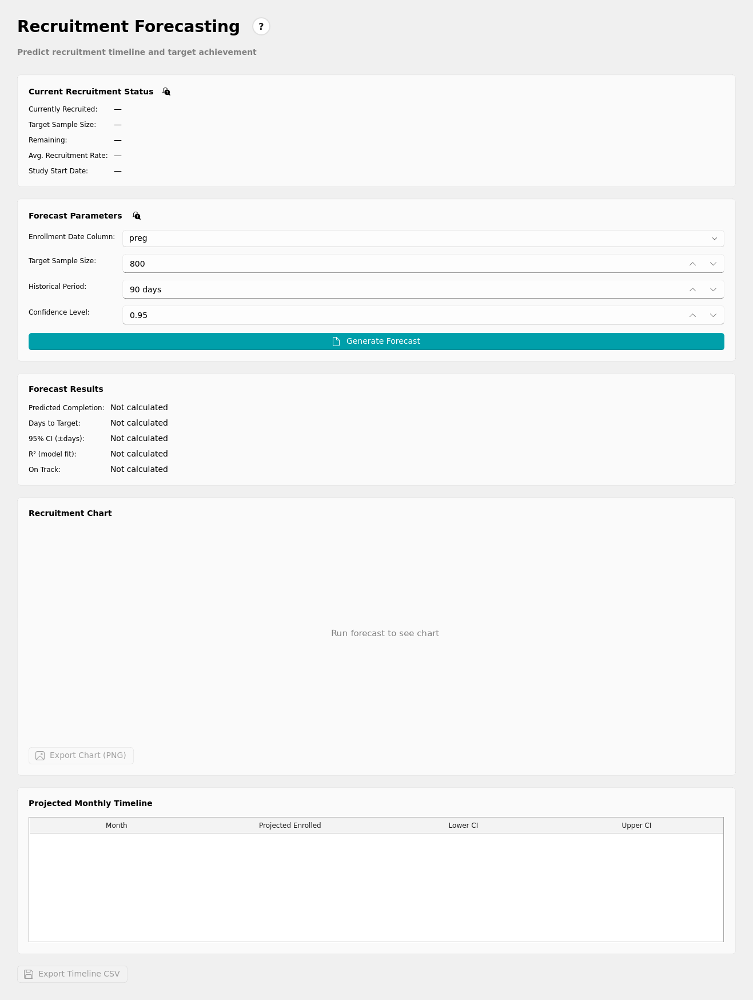
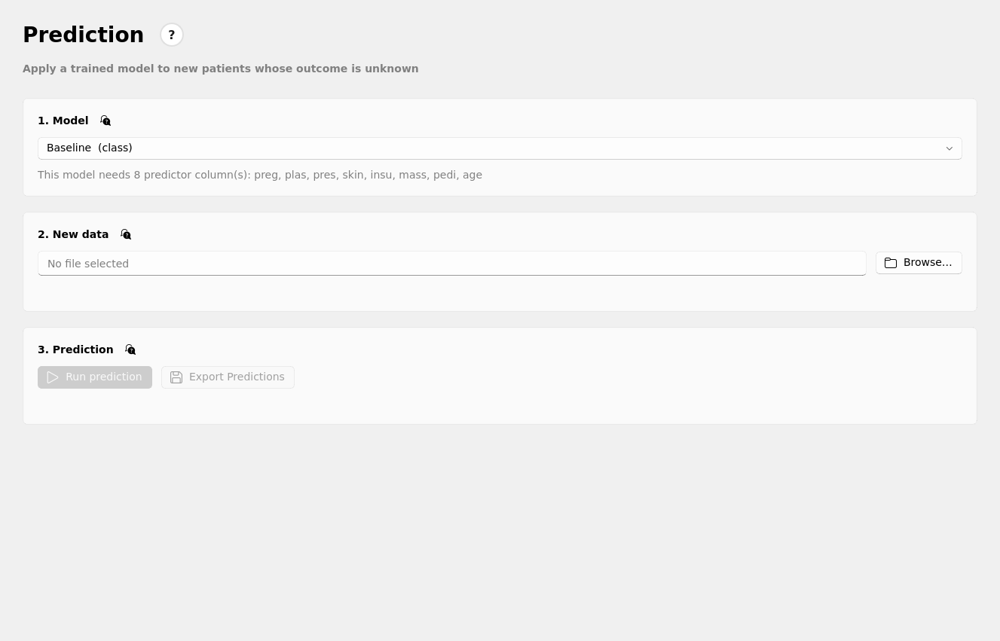

# HAMELIN — Manual de usuario

> Spanish edition of the manual (some sections may lag behind). The English manual, [MANUAL.md](MANUAL.md), is the reference.

**HAMELIN** (Human-guided Automated Machine Learning for Clinical Studies) es una aplicación de escritorio para profesionales de investigación clínica (CRPs) que necesitan gestionar estudios clínicos, analizar datos de pacientes y construir modelos predictivos — sin necesidad de saber programar ni de conocimientos de Machine Learning.

Este documento describe, con el detalle suficiente para trabajar sin sorpresas, cómo está organizada la aplicación y qué hace cada pantalla. Está escrito a partir del código y de los textos de ayuda ya integrados en la propia app (página **Help**), no es una traducción libre: cuando algo aquí discrepe de lo que ves en pantalla, la aplicación manda.

> Para quién no es Hamelin: no sustituye a un bioestadístico o data scientist para análisis complejos, no gestiona consentimientos informados ni documentación regulatoria, no es un CDMS (úsalo junto a tu EDC — REDCap, OpenClinica, etc.), y no envía datos a ningún servicio en la nube: todo corre localmente en tu máquina.

---

## 1. Instalación y primer arranque

**Requisitos:**
- Windows 10/11 (64-bit), macOS 12+, o Ubuntu 20.04+.
- Python 3.12 (gestionado por `uv`).
- RAM: 8 GB mínimo; 16 GB recomendado para datasets grandes (>10.000 filas).
- Disco: espacio para la app + tus datasets.

**Arranque:**
```bash
cd hamelin/
uv run hamelin
```
En el primer arranque se muestra la página **Home** sin proyectos. No hace falta configuración previa.

**Modo debug** (más detalle en el log, trazas completas en los diálogos de error):
```bash
uv run hamelin --debug
```
Otros flags: `--config <ruta>` (config personalizada), `--version`, `--no-gui`.

---

## 2. Flujo de trabajo recomendado

```
PROJECT  →  DATA  →  TRAINING  →  EVALUATION  →  PREDICTION
                                                      │
                                               FORECASTING (opcional)
```

1. **Project**: crea o abre un proyecto y rellena los metadatos del estudio.
2. **Data**: carga el dataset de pacientes (CSV, Excel, SPSS...). La generación de **Table 1** vive al final de esta misma pestaña.
3. **Training**: entrena un modelo predictivo con AutoML.
4. **Evaluation**: página dedicada (justo después de Training en el menú) para inspeccionar y comparar todos los modelos entrenados en el proyecto.
5. **Prediction**: aplica un modelo entrenado a pacientes nuevos cuyo resultado aún no se conoce.

**Forecasting** es opcional: predice cuándo alcanzarás tu objetivo de reclutamiento; úsalo si es relevante para tu estudio.

Cada paso es una pestaña del menú lateral izquierdo (Help y Settings están fijados abajo del todo; el resto, incluidos Evaluation, Prediction y Forecasting, está en la lista principal). Puedes ir hacia adelante y hacia atrás libremente.


*Página Home con un proyecto abierto: resumen rápido de proyectos, datasets y modelos, con acceso al resto de la app desde el menú lateral (Home, Projects, Data, Training, Evaluation, Prediction, Forecasting; Help y Settings abajo).*

---

## 3. Página "Project" (Proyectos)


*Pantalla selectora de proyectos, con los tres botones de acción arriba y las tarjetas de proyectos guardados debajo.*

### 3.1 Pantalla selectora
Al entrar en "Project" ves una lista de tarjetas, una por proyecto guardado, con nombre, tipo de estudio, nº de datasets/modelos y fecha de última modificación. Cada tarjeta tiene:
- **Select**: marca el proyecto como activo sin abrir su formulario de metadatos.
- **Open**: abre el formulario completo de metadatos de ese proyecto.

Arriba de la lista hay tres botones:

| Botón | Qué hace |
|---|---|
| **New Project** | Abre el formulario en blanco para crear un proyecto rellenando todos los campos. |
| **Quick Project** | Se salta el formulario: crea un proyecto al instante con datos de marcador de posición generados automáticamente (nombre, acrónimo, número de protocolo con timestamp). Útil para empezar a cargar datos ya; abre el proyecto después desde esta misma pantalla para rellenar los datos reales. |
| **Delete All Projects** | Borra permanentemente **todos** los proyectos guardados y todo su contenido (datasets, resultados, modelos), tras una confirmación. No se puede deshacer. Si tenías un proyecto abierto en otras pestañas (Data, Training...) en el momento de borrar, esas pestañas no se limpian automáticamente hasta que navegues o reinicies. |

### 3.2 Formulario de metadatos

| Campo | Obligatorio | Notas |
|---|---|---|
| Project Name | Sí | Nombre completo oficial del estudio. |
| Acronym | Sí | Código corto en mayúsculas, único, solo letras y números. **No se puede cambiar después de guardar** — es el nombre de la carpeta en disco. |
| Protocol Number | Sí | Identificador oficial del protocolo. |
| Principal Investigator | Sí | Nombre del investigador principal. |
| Contact Email | Sí | Debe tener formato de email válido. |
| Institution | Sí | Hospital/universidad/centro. |
| Study Type | No | Patient Registry / Observational Study / Clinical Trial. |
| Ethics Committee / Approval Number / Approval Date | No | Sección de aprobación ética. |
| Target Sample Size | Sí (>0) | Nº de pacientes objetivo; lo usa la página Forecasting. |
| Start Date / Expected End Date | No | Fechas de reclutamiento, también usadas en Forecasting. |
| Primary Objective / Secondary Objectives | No | Texto libre; aparece tal cual en los informes generados. |

Botones del formulario: **Save Project**, **Reset** (limpia el formulario), **← Back to Projects** (descarta sin guardar).

### 3.3 Dónde se guarda todo

```
workspace/Projects/<ACRÓNIMO>/          (nombre de carpeta siempre en inglés, "Projects")
    metadata.json                        : metadatos del proyecto
    data/                                 : datasets vinculados a este proyecto
    data/dataset_index.json               : registro de datasets
    results/                              : resultados de entrenamiento y exportaciones
    results/models/<nombre del modelo>/   : un modelo entrenado por carpeta (pesos, config, predicciones de test)
    results/tables/                       : Table 1 y dataset limpio exportados
    results/reports/                      : informe de calidad, resumen del dataset e informe de modelo
    results/forecasts/                    : gráfico y timeline de Forecasting
    results/predictions/                  : predicciones exportadas desde Prediction
```

Los cuadros de **Export…** de cada página se abren por defecto en la subcarpeta correspondiente de `results/` del proyecto activo (se crea al momento), para que lo que genera un proyecto se quede con el proyecto; puedes elegir cualquier otra ruta en el propio cuadro. Sin proyecto abierto se comportan como siempre.

**Orden garantizado.** Todo lo que se genera para un proyecto vive en su carpeta: datasets en `data/`, y modelos, informes y exportaciones en `results/` (el resumen automático de cada dataset va a `results/reports/`). Solo hay una carpeta desechable, `ludwig_runs/`, donde Ludwig vuelca cada trial de la búsqueda (a veces cientos de MB de checkpoints): Hamelin la borra al terminar (o fallar/cancelar) cada entrenamiento y al abrir el proyecto, porque el modelo ganador ya está en `results/models/`. Al abrir un proyecto de una versión anterior también se colocan en su sitio los modelos de `model_checkpoints/` y los resúmenes que estaban en `data/`. Los logs técnicos diarios se conservan 30 días; `usage_log.csv` (datos del estudio de usabilidad) nunca se borra solo.

Puedes hacer copia de seguridad de toda la carpeta `Projects/` a cualquier sitio. Fuera de un proyecto concreto:

```
workspace/logs/hamelin_YYYY-MM-DD.log     : log técnico de la app (uno por día)
workspace/logs/usage_log.csv              : registro de uso — ver sección 12
workspace/data/                            : datasets sueltos, aún no vinculados a un proyecto
```

`workspace/` está excluido de git (no se sube al repositorio); es contenido local, generado por el uso de la app.

---

## 4. Página "Data"


*Dataset real cargado (768 filas × 9 columnas) desde el registro de datasets del proyecto: origen y métricas arriba, inspección de datos (con eliminar filas y excluir outliers), Variables & Types, resumen de datos y, debajo, la sección Table 1 con el resultado ya generado.*

### 4.1 Formatos soportados
CSV, TSV, Excel (`.xlsx`, primera hoja), Parquet, JSON/JSONL, Feather, HDF5, HTML (una sola tabla), SPSS (`.sav`), Stata (`.dta`), SAS (`.xpt`, `.sas7bdat`), Ancho Fijo (`.fwf`), DataFrame serializado (`.pkl`/`.pickle` — abre solo ficheros de confianza). Son los 14 formatos que documenta Ludwig oficialmente. Requisitos: cabecera en la primera fila, una fila por paciente, sin celdas combinadas ni formato decorativo (en Excel).

### 4.2 Cargar un dataset
1. **Browse** → selecciona el fichero.
2. **Load**.

Con un proyecto activo, el fichero se copia automáticamente a `data/` del proyecto y queda registrado para recargarlo luego desde el selector "Project datasets", sin tener que volver a buscarlo. HAMELIN detecta automáticamente el tipo de cada columna y lanza en segundo plano un análisis con Ludwig para inferir el tipo de variable más adecuado para ML.

### 4.3 Vista previa y edición
La tabla de vista previa muestra todas las filas y columnas. Valores especiales: `NaN` (número faltante), `NaT` (fecha faltante), celda vacía (igual que los anteriores en la práctica), `inf` (desbordamiento numérico — trátalo como problema de calidad de datos).

- Clic en cabecera de columna → modo "selección de columnas". Clic en nº de fila → modo "selección de filas". Ctrl/Shift para selección múltiple.
- **Remove Selected**: oculta lo seleccionado del análisis (no se borra de verdad).
- **Restore All**: recupera todo lo oculto.
- **Remove Duplicates**: elimina filas duplicadas.
- **Exclude Outliers** / **Restore Excluded**: excluye/recupera outliers.
- **Export**: exporta el dataset "limpio" (con lo oculto ya fuera) en CSV, Excel o Word.

### 4.4 Lista de variables y tipos (Variable List)
Cada columna aparece con su tipo inferido: 🔢 number, ⭕ binary, 📝 category, 📅 date, 📄 text, 📈 sequence, ⏱ timeseries, ➡ vector. El análisis puede tardar hasta ~30s en datasets grandes (la primera vez que se usa en una sesión, ver sección 11.2 sobre el coste de importación de Ludwig).

Puedes anular el tipo de cualquier columna con el desplegable "Set type" junto a ella (la fila se resalta). **Reset Types to Inferred** revierte todas las anulaciones manuales (nunca toca los valores reales del dataset).

### 4.5 Informe de calidad y resumen
- **Generate Quality Report**: CSV con una fila por variable (tipo, nulos, % faltante, valores únicos, min/max/media para numéricas). Tú eliges dónde guardarlo.
- **Data Summary**: tarjeta de texto plano con un resumen del dataset, visible en la propia página; **Export Data Summary** lo guarda en `.txt`/`.md`.
- Gráfico automático de las 10 variables con más datos faltantes.

### 4.6 Table 1 (características basales)
Vive al final de esta misma pestaña Data (no tiene su propio botón "Browse" — usa el dataset ya cargado arriba).

1. En "Select Variables for Table 1", cada columna aparece marcada por defecto; las que HAMELIN sugiere excluir (identificadores, texto libre, varianza cero...) o que parecen buena variable de agrupación aparecen marcadas directamente en su fila.
2. **Apply All Recommendations** actúa sobre esas sugerencias automáticamente, o marca/desmarca tú mismo.
3. En "Table Settings": **Grouping Variable** (opcional — variable categórica que divide la tabla en grupos y añade un test estadístico: t-test/ANOVA para numéricas, Chi-cuadrado/Fisher para categóricas), **Missing data** (mantener o descartar filas con valores faltantes), **Show p-values**.
4. **Generate Table 1**.
5. **Export**: CSV, Excel o Word.

Interpretación: numéricas → media±DE (normal) o mediana (RIC) (sesgada); categóricas → n (%); p-valor <0.05 → diferencia significativa entre grupos.

---

## 5. Página "Forecasting" (opcional)


*Pronóstico de reclutamiento ya generado sobre un dataset de ejemplo con fechas de inclusión: estado actual, parámetros, resultados, gráfico y tabla mensual. Los botones de exportación proponen `results/forecasts/` del proyecto.*

Ajusta un modelo estadístico sobre el ritmo de reclutamiento histórico para estimar cuándo se alcanzará el **Target Sample Size** del proyecto.

**Entradas necesarias:** un dataset cargado con una columna de fecha de inclusión (una fila por paciente), y el Target Sample Size (viene precargado desde los metadatos del proyecto).

**Parámetros:**
- **Enrollment Date Column**: solo se listan columnas de tipo fecha.
- **Target Sample Size**: editable aquí, aunque venga precargado.
- **Historical Period (days)**: cuántos días pasados usar para estimar la velocidad de reclutamiento (por defecto 90).
- **Confidence Level**: intervalo de confianza de la fecha estimada (0.95 por defecto).

**Gráfico**: línea sólida = reclutamiento histórico acumulado; línea discontinua = proyección; banda sombreada = intervalo de confianza (si es muy ancha, el reclutamiento ha sido irregular); líneas horizontales/verticales discontinuas = objetivo y fecha estimada.

**Panel de estado actual**: pacientes reclutados, objetivo, restantes, tasa media mensual, fecha de inicio del estudio.

**Export Timeline CSV**: tabla de hitos mensuales (mes, esperado, límite inferior/superior).

---

## 6. Página "Training"


*Página Training con el dataset cargado, el resultado y los predictores elegidos (tarjetas 1–2 arriba; la configuración del modelo y el control del entrenamiento, más abajo).*

### 6.1 Concepto
Entrenar un modelo significa enseñar a un programa a reconocer patrones en tus datos asociados a un resultado clínico de interés. HAMELIN usa **AutoML vía Ludwig**: selecciona y configura automáticamente el mejor algoritmo — no necesitas saber qué es un Random Forest o una red neuronal.

### 6.2 Paso 1 — Variables
- **Outcome variable**: la columna que quieres predecir.
- **Predictor variables**: clic para seleccionar (Ctrl/Shift para varias; no hay "Select All"). Regla general: incluye variables disponibles ANTES de conocer el resultado; excluye ID de paciente, códigos administrativos y columnas de fecha; excluye variables con >50% de valores faltantes salvo que vayas a imputarlas.
- **Secondary outcomes** (opcional): otros resultados clínicos a predecir junto al principal — esto entrena un modelo multi-output real, no es solo anotación. Una columna marcada a la vez como predictor y como resultado secundario se trata solo como predictor.

### 6.3 Paso 2 — Criterios de selección de pacientes
Constructor visual de reglas de inclusión/exclusión (Columna, Operador, Valor — sin caja de texto libre). Un paciente que NO cumple TODAS las reglas de inclusión queda excluido; un paciente que cumple CUALQUIER regla de exclusión también. Botón **Preview** en cada bloque para ver cuántas filas coinciden antes de comprometerte. **Save preset** / **Reset preset** guardan estos criterios como JSON reutilizable del proyecto, bajo `training_schemas/`.

### 6.4 Paso 3 — Configuración del modelo

Solo se muestran tres campos por defecto; el resto vive tras "▶ Advanced options".

| Campo | Detalle |
|---|---|
| **Model name** | Viene rellenado con un nombre libre (`model_1`, `model_2`…); escribe el tuyo para reemplazarlo. Nombre de la carpeta donde se guarda el modelo; aparecerá en el Historial y en "Evaluation". |
| **Prediction type** | Binary classification (2 valores) / Multi-class classification (≥3 categorías) / Regression (número continuo). No es solo una sugerencia: fuerza a Ludwig a entrenar ese tipo de modelo. |
| **Evaluation metric** | **La lista cambia según el Prediction type**, porque Ludwig solo soporta ciertas métricas por tipo de salida: <br>• **Binary**: AUC-ROC, Accuracy, Precision, Recall, Specificity.<br>• **Multi-class**: Accuracy, Hits at K.<br>• **Regression**: RMSE, MAE, MSE, RMSPE (todas miden error medio — cuanto más bajo, mejor). |

### 6.5 Opciones avanzadas


*Tarjeta 3 (Model Configuration) con "Advanced options" desplegado y tarjeta 4 (Training Control): **Model name** viene rellenado (`model_2`, el primer nombre libre), **Time Budget (s)** está siempre en segundos (300 por defecto; la unidad va en la etiqueta, no dentro del campo), **Hyperparameter Search Strategy** sustituye al antiguo «Search Strategy», y junto a **Start Training** están **Preview Config** y **Train from Config File…**. Con "Binary classification" seleccionado, Handle Class Imbalance está habilitado (en Off por defecto); en Multi-class o Regression se desactiva solo.*

| Campo | Detalle |
|---|---|
| **Time budget (segundos)** | Límite de tiempo de búsqueda, siempre en segundos (por defecto `300`, mínimo `100`). El entrenamiento se detiene al alcanzarlo aunque no se hayan completado las iteraciones máximas. **Se escribe directamente en el campo** (sin flechas de incremento). |
| **Final evaluation holdout (%)** | Porcentaje de pacientes apartado ANTES de entrenar, nunca usado en el entrenamiento — solo para la evaluación final. Por defecto `0.20`. **Se escribe directamente** (p.ej. `0.2`), sin flechas. *(Nota técnica: este holdout se separa fuera de Ludwig antes de pasarle los datos; Ludwig hace además su propio split interno del resto — no es exactamente el mismo mecanismo que `preprocessing.split` de la configuración nativa de Ludwig.)* |
| **Random Seed** | Asegura resultados reproducibles entre ejecuciones con la misma semilla. |
| **Hyperparameter search strategy** | No optimisation (valores por defecto de Ludwig, más rápido) / Random search / Bayesian optimization (recomendado, más eficiente) / Grid Search (Exhaustive search — prueba TODAS las combinaciones, muy lento). |
| **Max. iterations** | Nº máximo de configuraciones a probar (si hay estrategia de búsqueda activa). **Mínimo y valor por defecto: 10.** Es un límite superior: el límite de tiempo siempre tiene prioridad, así que con un presupuesto corto (p. ej. 100 s) la búsqueda se detiene antes de completar todas las iteraciones. |
| **Parallel trials** | Cuántos trials (entrenamientos completos) se ejecutan a la vez, sea cual sea la estrategia de búsqueda. El valor por defecto se calcula para tu equipo (un trial por núcleo y por cada 2 GB de RAM, entre 1 y 8; p. ej. 3 en un portátil de 4 núcleos y 8 GB). Más trials en paralelo acaban antes pero pueden bloquear el equipo. |
| **Early stopping** | Tres modos: **Automatic** (recomendado; el planificador de búsqueda de Ludwig detiene los trials débiles, nada que ajustar), **Stop when no longer improving** (cada trial se detiene tras *Patience* rondas de evaluación sin mejorar la puntuación de validación, 5 por defecto; la búsqueda pasa a `scheduler: fifo`, sin el planificador automático) y **Off** (cada trial entrena todas sus épocas hasta el límite de tiempo). Ludwig no puede combinar una paciencia con su planificador automático —lo pone a -1 (`trainer.early_stop`)—, de ahí los modos separados. |
| **Handle Class Imbalance** | Interruptor. **Solo disponible para Binary classification** — Ludwig no soporta balanceo de clases para multiclase ni regresión, así que el interruptor aparece desactivado (gris) y se desmarca automáticamente en esos casos. |
| **Missing numeric values strategy** | Desplegable (ya no es un simple interruptor on/off) con las estrategias reales que documenta Ludwig para columnas numéricas: *Ludwig default* (rellena con 0, sin tocar nada), *Fill with column mean*, *Fill with most frequent value*, *Forward fill*, *Backward fill*, *Drop rows with missing value*. |

### 6.6 Entrenar y monitorizar
1. **Start Training** (solo activo con un dataset cargado).
2. Barra de progreso y log de entrenamiento en tiempo real — no cierres la app mientras entrena.
3. Al terminar, el panel de Resultados muestra 4 tarjetas según lo entrenado: clasificación (AUC-ROC, Accuracy, Sensitivity, Specificity) o regresión (R², RMSE, MAE, Loss); cualquier otra métrica de Ludwig aparece en una línea más pequeña. Matriz de confusión y curva ROC para tareas de clasificación, cuando están disponibles.
4. **Stop** cancela en cualquier momento; se muestran los resultados parciales hasta el último trial completado.

**Preview Config** (junto a Start Training): abre una ventana de solo lectura con la configuración de Ludwig que se usará, construida a partir de tus elecciones en *Model Configuration* — sin entrenar. AutoML completa el resto (arquitectura, encoders…) al empezar; si has preparado una config fija (modelo duplicado o archivo importado), muestra esa config exacta. La configuración final completa de cada modelo entrenado se consulta después en la página *Evaluation* (**View Config**).

**«How to read this result»** (en inglés, debajo del resumen verde; aparece tras entrenar y, para cada modelo, en *Evaluation*). Lo generan **reglas explícitas** (no un modelo de IA), así que es reproducible y auditable. Contiene:

| Bloque | Qué dice |
|---|---|
| **Verdict** | Bueno / moderado / débil. Binaria: por el AUC (≥ 0,90 excelente, 0,80–0,89 bueno, 0,70–0,79 moderado, < 0,70 limitado). Multiclase: exactitud frente a acertar siempre la clase más frecuente (+15 puntos = bueno, +5 = moderado). Regresión: por R² (≥ 0,90 / 0,70 / 0,50; negativo = peor que predecir la media). |
| **Why** | Qué significa cada número y con qué se compara: AUC, exactitud frente a la línea base, sensibilidad/especificidad y su desequilibrio, precisión (depende de la prevalencia), R² y error típico frente a la dispersión del resultado. |
| **How reliable is this estimate?** | Pacientes de test (< 100 = pocos), IC 95 % del indicador principal, sobreajuste (brecha train–test > 0,10) y aviso si el resultado es sospechosamente alto (≥ 0,95: buscar fugas de información). |
| **How it could be improved** | Revisar predictores, más pacientes, estrategia de valores faltantes, búsqueda de hiperparámetros, desbalance de clases (< 25 %), umbral de decisión, comparar variantes. Solo aparece lo que aplica a ese modelo. |
| **Before relying on it** | Validación interna en un único split aleatorio (hace falta validación externa), calibración no comprobada, subgrupos, apoyo a la decisión y no diagnóstico. |

Son reglas empíricas para modelos de predicción clínica: ayudan a interpretar, no sustituyen el criterio clínico ni estadístico. El código está en `analytics/result_advice.py`.

**Interpretación rápida:**
- AUC-ROC: 0.5 = azar, 0.7 = aceptable, 0.8 = bueno, 0.9 = excelente (verifica que no haya data leakage), 1.0 = casi siempre indica fuga de datos.
- R²: 1.0 = ajuste perfecto, 0.7–0.9 = bueno/excelente, 0.5–0.7 = moderado, <0.5 = débil, <0 = peor que predecir siempre la media (el target puede no ser predecible con esos predictores).
- RMSE/MAE: mismas unidades que la variable de resultado; MAE más fácil de interpretar directamente, RMSE penaliza más los errores grandes.

**Dónde queda la configuración de cada entrenamiento.** Tras entrenar, todo lo elegido en la página queda dentro de la carpeta del modelo, `results/models/<nombre>/`:

| Fichero | Contenido |
|---|---|
| `training_settings.json` | **Todo lo elegido en Training**: nombre, resultado, predictores, resultados secundarios, reglas de inclusión/exclusión, tipo de predicción, métrica, límite de tiempo, hold-out, semilla, estrategia y nº de iteraciones/trials en paralelo, early stopping, valores faltantes, desbalance de clases, filas usadas y excluidas, y la **configuración parcial de Ludwig** que Hamelin envió (la misma que muestra *Preview Config*). |
| `model_hyperparameters.json` | La configuración **completa final** de Ludwig del modelo entrenado (arquitectura elegida por AutoML incluida). Es lo que muestra *View Config* en Evaluation. |
| `training_report.json` | Informe de Ludwig: configuración, versiones, semilla y métricas. |

Se ha verificado con un entrenamiento real de valores no predeterminados: métrica, estrategia de búsqueda, iteraciones, trials en paralelo, límite de tiempo (`hyperopt.executor.time_budget_s`), semilla, hold-out (192 de 768 filas = 25 %), valores faltantes, desbalance de clases y tipo de predicción llegan a la configuración de Ludwig y/o a `training_settings.json`. **Early stopping:** Ludwig pone `trainer.early_stop` a -1 mientras un planificador de trials está activo, así que Hamelin ofrece tres modos explícitos (automático, por paciencia, desactivado); el modo por paciencia cambia el planificador a `fifo`, y todo queda en `training_settings.json`.

**Export Trained Model**: guarda un **informe JSON** de la última ejecución (tipo de modelo, resultado, predictores, dataset, métricas e hiperparámetros) en `results/reports/`, útil para auditoría y notas de reproducibilidad; el modelo en sí no va en ese archivo. Cada modelo entrenado también se guarda automáticamente en su propia carpeta dentro de `results/models/` del proyecto (pesos, `model_hyperparameters.json` con la configuración completa y, normalmente, `test_predictions.csv`). Los proyectos de versiones anteriores, que usaban una carpeta `model_checkpoints/`, se migran solos la primera vez que se abren.

---

## 7. Página "Evaluation"


*Pestaña **Models**: lista de modelos entrenados (con estrella de favorito) y, para el seleccionado, detalles, tarjetas de métricas con intervalo de confianza, matriz de confusión interactiva y curva ROC, notas e informe.*

Vista dedicada (entre Training y Prediction en el menú) a **todos** los modelos entrenados en el proyecto, no solo el último. Es una página nativa, con el mismo tema visual que el resto de la app, y conserva las funciones de la antigua página "Models". Tiene dos pestañas: **Models** y **Compare**. Necesita un proyecto abierto para saber dónde buscar.

### 7.1 Pestaña Models
Una fila por modelo (★, nombre, variable de resultado, algoritmo, métrica principal de test y fecha), el más reciente primero. Clic en una fila para inspeccionarla; Ctrl/Mayús-clic para seleccionar varias; clic en la ☆ para marcar un favorito (se guarda en `results/models/favorites.json`).

Con **un** modelo seleccionado se muestra debajo:

- **Detalles**: cuándo se entrenó, dataset, semilla, versión de Ludwig, qué predice, variables predictoras, pacientes evaluados (exacto o aproximado), arquitectura del modelo (combiner, encoders, decoders, optimizador, tamaño de lote; descritos según la documentación de Ludwig) y el proyecto/objetivo.
- **Tarjetas resumen** y lectura en lenguaje sencillo, igual que justo tras entrenar.
- **Test metrics**: una tarjeta por métrica medida en el conjunto de test, con nombre en lenguaje llano y, donde se puede calcular (exactitud, R², RMSE, MAE), **intervalo de confianza del 95 %** por *bootstrap* de `test_predictions.csv`. Si las predicciones incluyen un atributo del paciente con pocos valores (p. ej. sexo), **Break down by** muestra la exactitud por grupo y avisa de los grupos con menos de 30 pacientes.
- **Matriz de confusión**: filas = resultado real, columnas = predicción; alterna **Show % / Show counts**, **clic en una celda** para listar los pacientes de esa celda (con su confianza) y, en modelos de dos clases, cambia el **umbral de decisión** (50 % por defecto) para ver cómo cambian los errores. Junto a ella, la curva ROC (binarios). **Export** guarda la tabla como PNG/PDF más un CSV.
- **Notas** (`notes.txt` en la carpeta del modelo) y **Export report**: proyecto, modelo, variables, tamaño de evaluación y métricas, en CSV o PDF.

Botones bajo la lista: **View Config** (configuración exacta de Ludwig, solo lectura y copiable), **Duplicate and Retrain** (precarga Training con esa configuración bajo el nombre `<nombre>_copy` y te lleva allí; nada se guarda hasta que entrenes), **Compare selected**, **Delete selected** y **Delete non-favorites** (ambos piden confirmación y borran también la carpeta del modelo), y **Open models folder**.

### 7.2 Pestaña Compare


*Pestaña **Compare**: modelos marcados, controles y la vista de tabla ordenada por la métrica elegida (el mejor valor de cada columna en negrita). Debajo, tamaño de evaluación de cada modelo.*


*Vista **Radar**: un modelo (elegido en el desplegable) frente a la media de los marcados; más lejos del centro = mejor (las métricas donde menos es mejor se invierten).*

Marca dos o más modelos (o selecciónalos en *Models* y pulsa **Compare selected**), elige la métrica y una vista:

| Vista | Qué muestra |
|---|---|
| **Table** | Ranking por la métrica elegida; clic en una cabecera reordena; clic en ☆ marca favorito; **Confidence intervals** añade el IC 95 %. |
| **Graph** | Una barra por modelo, la mejor en verde. |
| **Heatmap** | Modelos × métricas; más brillante = mejor por columna (las métricas donde menos es mejor se invierten). |
| **Radar** | Un modelo frente a la media de los marcados. |

Controles: **What matters most** (salta a la métrica que responde a una prioridad clínica: detectar casos, evitar falsas alarmas, equilibrio, rendimiento global), **Test / Train metrics**, **All metrics** (desactívalo para ver solo las clave), **Favorites only**, **Compare settings** (con exactamente dos modelos: tabla de ajustes de Ludwig que difieren, con explicación en lenguaje llano) y **Export** (PNG/PDF + CSV). Compara solo modelos que predicen el mismo resultado sobre el mismo tipo de datos.

### 7.3 Dónde se guarda
Cada modelo vive en `results/models/<nombre>/` del proyecto (pesos, `model_hyperparameters.json`, `training_report.json`, `test_predictions.csv`, y `notes.txt` si hay notas). Las exportaciones de esta página se proponen en `results/reports/`.

---

## 8. Página "Prediction"


*Página Prediction tras ejecutar una predicción sobre 80 pacientes sin columna de resultado: modelo elegido, comprobación de columnas en verde, y la tabla con las columnas originales seguidas de `predicted_class`, `confidence_class` y una probabilidad por clase. **Export Predictions** propone `results/predictions/`.*

Aplica un modelo entrenado a un dataset **sin columna de resultado** (p. ej. pacientes reclutados después de entrenar) y devuelve una predicción por fila. No modifica el modelo ni los datos del proyecto.

1. **Model**: un modelo entrenado en el proyecto, o **Browse external model…** para elegir cualquier carpeta con un modelo Ludwig guardado (debe contener `model_hyperparameters.json`), p. ej. uno compartido por un colega.
2. **New data**: **Browse…** y carga un archivo (mismos formatos que la página Data). No hace falta la columna de resultado.
3. **Comprobación automática**: se comparan las columnas del archivo con los predictores del modelo. Si falta alguna se lista en rojo y **Run prediction** queda desactivado; las columnas extra se conservan.
4. **Run prediction**: se ejecuta en segundo plano (`LudwigModel.predict`, backend local).
5. **Resultados**: vista previa (primeras 500 filas) con las columnas originales seguidas de `predicted_<resultado>`, `confidence_<resultado>` (clasificación) y `prob_<resultado>_<clase>` por clase. **Export Predictions** guarda todas las filas en CSV o Excel.

Las predicciones son apoyo a la decisión, no un diagnóstico: un modelo solo es fiable con pacientes parecidos a los de su entrenamiento.

---

## 9. Página "Settings"


*Página de configuración: apariencia, idioma, preferencias de exportación y opciones avanzadas.*

| Sección | Contenido |
|---|---|
| **Appearance** | Tema (Light/Dark/Auto según el SO) y tamaño de fuente (8–16pt, aplica sin reiniciar). |
| **Language** | Español/English — el cambio de idioma de la interfaz requiere reiniciar la app. Los informes generados (Table 1, Quality Report) siempre se generan en el idioma seleccionado aquí. |
| **Export Preferences** | Ya no hay un formato de exportación "por defecto" global: se elige en cada momento junto al botón de exportar correspondiente. Lo que queda aquí es **Decimal Places** (decimales en los informes exportados; 2 recomendado para informes clínicos, 4 para análisis interno). |
| **Advanced: Log Level** | DEBUG / INFO (por defecto) / WARNING / ERROR — verbosidad del log técnico. |
| **Debug mode** | Vía línea de comandos (`uv run hamelin --debug`), no desde aquí. |

---

## 10. Página "Help"


*Manual integrado: 9 secciones plegables (aquí todas colapsadas) con los botones Expand All / Collapse All arriba.*

Manual de ayuda integrado en la propia app, con **9 secciones**: 1 Introduction, 2 Getting Started, 3 Projects, 4 Data (Table 1 incluido como parte de esta sección, no aparte), 5 Training, 6 Evaluation, 7 Prediction (ambas en el mismo orden que el menú de navegación), 8 Forecasting, 9 Glossary. Settings no tiene sección propia — es autoexplicativo en pantalla. Cada sección es expandible/colapsable; botones **Expand All** / **Collapse All** arriba. Casi todos los campos de la interfaz tienen además un icono "?" propio que abre una explicación puntual sin salir de la página en la que estás.

Varios bloques incluyen ahora **capturas reales de la propia aplicación** directamente dentro del texto de ayuda (no solo en este manual externo) — por ejemplo, al expandir "Getting Started" verás la captura real de la pantalla de Proyectos con sus botones. Esto se implementó añadiendo soporte de imágenes a los bloques de ayuda (`_Block` en `help_page.py`); las imágenes viven en `src/hamelin/resources/help_images/` y no dependen de traducción (se muestran igual en inglés y español).

---

## 11. Arquitectura de la aplicación (para quien la mantenga)

### 11.1 Dos interfaces coexistiendo
HAMELIN tiene, a día de hoy, **dos capas de interfaz gráfica**:
- `src/hamelin/view/` + `controller/` + `model/` — la arquitectura MVC actual, descrita en todo este manual.
- `src/hamelin/interface/` — una app "modo simple" más antigua, con su propio `MainWindow`, widgets y utilidades, **que ya no se enlaza desde el menú**: la antigua página "Models", que la embebía entera, se reescribió de forma nativa como la página "Evaluation" (`view/pages/evaluation_page.py`) para que comparta tema y estilo con el resto de la app.

Todas las funciones de esa página (métricas con intervalos de confianza, desglose por subgrupo, matriz de confusión con umbral y lista de pacientes, comparación en tabla/gráfico/mapa de calor/radar, diff de ajustes, favoritos, notas, informe, arquitectura del modelo) están ya en la página nativa: la lógica sin Qt vive en `analytics/eval_data.py`, `analytics/setting_labels.py` y `analytics/architecture.py`, y la interfaz en `view/pages/evaluation_page.py` y `view/widgets/eval_*_panel.py`. El código antiguo sigue en el repositorio (y sus tests), y `view/` reutiliza sus utilidades sin Qt (`interface/utils/get_model_paths.py`, `metric_labels.py`, `bootstrap_ci.py`, `print_confusion_matrix.py`). Retirar del todo `interface/` queda pendiente.

**Textos de la interfaz.** Todo texto visible vive en `src/hamelin/i18n/strings.py` (inglés = fuente de verdad, español al lado) y se usa con `t("clave")`. Los avisos, etiquetas y ayudas de Training, Data, Forecasting, Project, Table 1 y los widgets compartidos se extrajeron del código con `tools/extract_ui_strings.py`; su versión española es por ahora el mismo texto inglés (marcador), y `tools/untranslated_strings.py` lista lo que falta traducir. Dos tests vigilan el sistema: `tests/test_i18n.py` (mismas claves en ambos idiomas) y `tests/test_i18n_usage.py` (toda clave usada existe y cada `.format()` recibe sus argumentos).

### 11.2 Por qué la primera carga de un dataset puede tardar
La inferencia de tipo de variable (sección 4.4) usa `ludwig.automl.base_config`, que internamente importa **todo** el subsistema de esquemas de Ludwig (encoders, decoders, combiners, hasta el esquema de modelos LLM, y `torchmetrics`) — no solo la parte de tipos. La primera vez que se usa en una sesión, esa importación puede tardar bastante (decenas de segundos en máquinas modestas). HAMELIN precalienta esa importación en segundo plano al arrancar (ver `prewarm_ludwig_type_inference()` en `analytics/variable_analyzer.py`), pero si cargas un dataset en los primeros segundos tras abrir la app, puedes notar el retraso igualmente. No es un fallo de HAMELIN — es el coste real de esa función concreta de Ludwig.

### 11.3 Todas las opciones de Training están verificadas contra la documentación oficial de Ludwig
Las métricas, estrategias de búsqueda y restricciones (p.ej. el balanceo de clases solo para binary) mostradas en la sección 6 de este manual se han contrastado explícitamente contra la documentación oficial de Ludwig (vendida localmente en `docs/ludwig/`, fuera del repositorio git). Si Ludwig se actualiza a una versión con un esquema de configuración distinto, esta sección debería revisarse de nuevo contra la doc de esa versión.

### 11.4 Esquema: de la pantalla Training a la configuración real de Ludwig

Ningún widget de la pantalla Training habla con Ludwig directamente. Todo pasa por un diccionario intermedio ("fields") que solo lleva lo que el usuario cambió de su valor neutro, y una función pura (`_fields_to_user_config`) que lo traduce a la sintaxis real de Ludwig:

```
┌─────────────────────┐      ┌───────────────────┐      ┌──────────────────────────┐
│  TrainingPage (UI)   │      │   fields: dict     │      │  Ludwig user_config      │
│                      │      │  (solo lo tocado)  │      │                          │
│  Prediction type ────┼─────▶│ problem_type       │      │ output_features[0].type  │
│  Evaluation metric ──┼─────▶│ metric              ├─────▶│ trainer.validation_metric│
│  Early stopping ─────┼─────▶│ early_stop(_mode)   │      │ trainer.early_stop +     │
│  (3 modos)           │      │                    │      │ executor.scheduler(fifo) │
│  Hyperparam. search ─┼─────▶│ search, max_iter,   │      │ hyperopt.search_alg,     │
│                      │      │ parallel_trials     │      │ hyperopt.executor        │
│  Handle Imbalance ───┼─────▶│ class_imbalance      │      │ preprocessing.           │
│  (solo si binary)    │      │ (+ problem_type)    │      │ oversample_minority      │
│  Missing values ─────┼─────▶│ missing_strategy     │      │ defaults.number.         │
│  strategy            │      │                      │      │ preprocessing.           │
│                      │      │                      │      │ missing_value_strategy   │
└─────────────────────┘      └───────────────────┘      └──────────────────────────┘
                                                                      │
                                                                      ▼
                                                        auto_train(user_config=...)
                                                     (se fusiona con lo que Ludwig
                                                      infiere automáticamente del
                                                      dataset — nada se pisa si el
                                                      usuario no tocó esa opción)
```

Por eso un campo dejado en su valor por defecto **no** se envía a Ludwig — se deja que Ludwig decida, en vez de forzar explícitamente su propio valor por defecto. Ver `src/hamelin/analytics/automl/ludwig_backend.py::_fields_to_user_config`.

---

## 12. Registro de uso (usage log)

Aparte del log técnico, HAMELIN guarda en `workspace/logs/usage_log.csv` un registro estructurado de **qué hace el usuario en la interfaz**: clics en botones, campos de formulario rellenados, navegación entre páginas, con marca de tiempo (segundos incluidos) para cada evento. Es un CSV con columnas `timestamp, session_id, page, action, element, detail`, pensado para poder analizarse directamente en Excel/pandas — por ejemplo, para un estudio de usabilidad y eficacia de la herramienta.

Además de clics y navegación, cada **aviso o error mostrado al usuario** (los banners de advertencia y error) se registra como `warning_shown` / `error_shown`, con el título como `element` y el texto como `detail`: así se pueden contar los errores cometidos por un participante sin instrumentar cada pantalla. `tools/usage_summary.py` resume el fichero por sesión y dataset (tiempo hasta el modelo, tiempo de entrenamiento, avisos, errores, ayudas, navegaciones); el cuestionario de evaluación de usuario está en [`CUESTIONARIO.md`](CUESTIONARIO.md). Las pruebas automáticas (`pytest`) redirigen este registro a un fichero temporal para no contaminar los datos reales.

Es un fichero separado del log técnico a propósito: uno es texto libre para depurar errores, el otro son datos tabulares para análisis. Ambos viven en `workspace/logs/`, fuera del control de versiones.

---

## 13. Glosario rápido

| Término | Significado |
|---|---|
| AutoML | Software que selecciona y configura automáticamente el mejor algoritmo para un dataset dado. |
| AUC-ROC | Métrica (0–1) de cuán bien un clasificador binario separa positivos de negativos. |
| Holdout set | Parte de los datos apartada del entrenamiento, usada solo para la evaluación final. |
| Hiperparámetro | Ajuste que controla cómo aprende el algoritmo (p.ej. learning rate), distinto de los parámetros que el modelo aprende de los datos. |
| Data leakage | Cuando información del futuro o del propio resultado se cuela en los datos de entrenamiento, dando un rendimiento irrealmente alto. |
| Ludwig | Framework de AutoML de código abierto (originalmente de Uber AI) que HAMELIN usa para entrenar modelos e inferir tipos de variable. |
| Overfitting | Cuando un modelo aprende demasiado bien los datos de entrenamiento y no generaliza a pacientes nuevos. |
| Random seed | Número que inicializa el generador aleatorio, para que los splits y las inicializaciones sean reproducibles. |

(Glosario clínico y de formatos de fichero completo disponible en la propia página Help de la app.)
