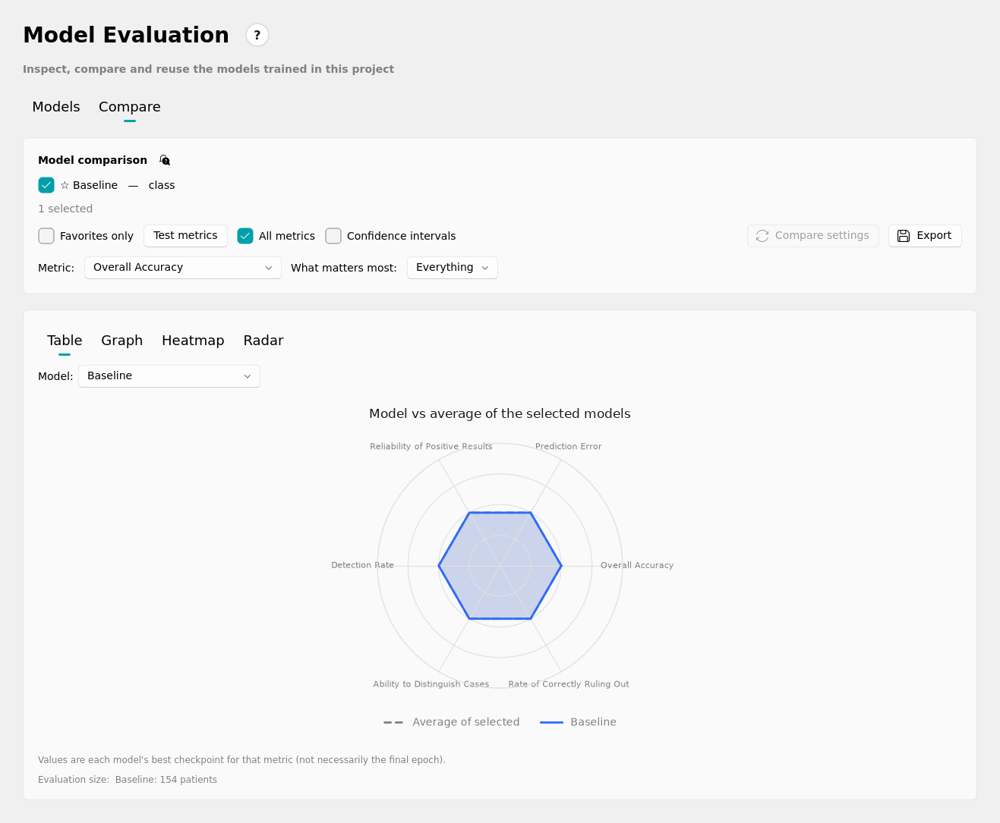
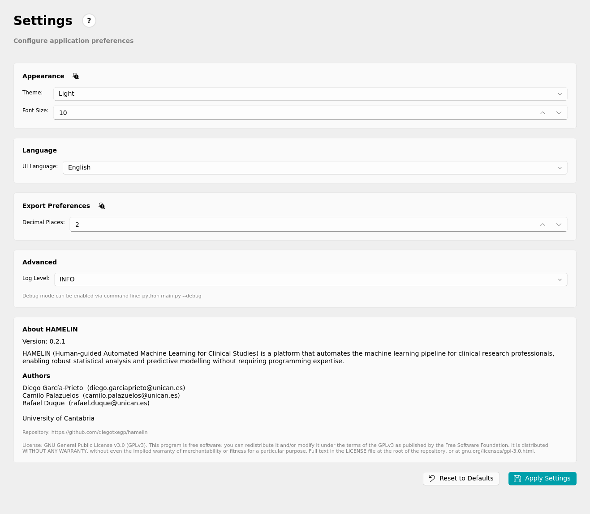
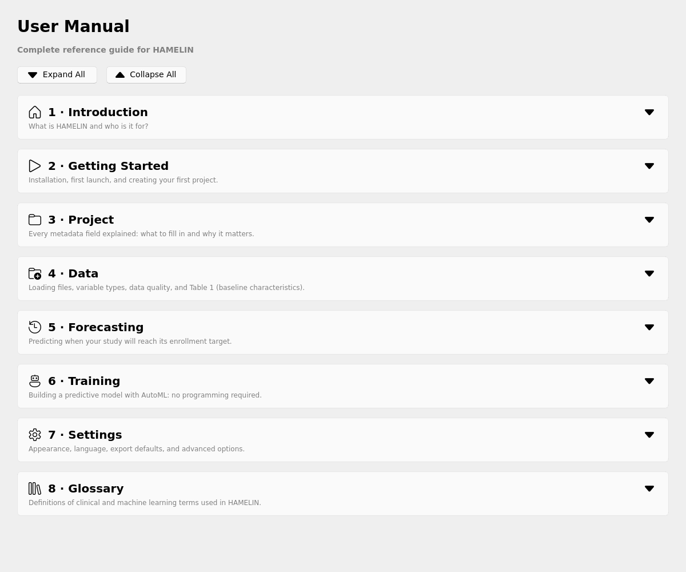

# HAMELIN — User Manual

**HAMELIN** (Human-guided Automated Machine Learning for Clinical Studies) is a desktop application for clinical research professionals who need to manage studies, analyse patient data and build predictive models — without programming and without machine-learning expertise.

This manual describes how the application is organised and what each screen does. The built-in **Help** page and the "?" icons next to most fields explain the same things in context; if something here differs from what you see on screen, the application is right.

> What HAMELIN is not: it does not replace a biostatistician for complex analyses, it does not manage informed consent or regulatory documents, it is not a clinical data management system (use it alongside your EDC — REDCap, OpenClinica, …), and it never sends data to any cloud service: everything runs locally on your computer.

---

## 1. Installation and first launch

**Requirements**
- Windows 10/11 (64-bit), macOS 12+ or Ubuntu 20.04+.
- Python 3.12 or newer (managed by `uv`).
- RAM: 8 GB minimum, 16 GB recommended for large datasets (> 10,000 rows).
- Disk: room for the application and your datasets.
- A GPU is optional. If the GPU is missing or not supported by the installed PyTorch, HAMELIN uses the CPU automatically.

**Launch**
```bash
cd hamelin/
uv sync
uv run hamelin
```
A splash screen appears immediately while the application loads. On the first launch the **Home** page shows no projects; no set-up is needed.

**Debug mode** (more detail in the log, full traces in error dialogs): `uv run hamelin --debug`. Other flags: `--config <path>`, `--version`, `--no-gui`.

The window opens at a size that fits your screen; maximise it if you prefer. Its size and maximised state are remembered.

---

## 2. Recommended workflow

```
PROJECT  →  DATA  →  TRAINING  →  EVALUATION
```

1. **Project** — create or open a project and fill in the study's metadata.
2. **Data** — load the patient dataset (CSV, Excel, SPSS, …), clean it and generate **Table 1**.
3. **Training** — train a predictive model with AutoML.
4. **Evaluation** — inspect and compare every model trained in the project.

**Prediction** (apply a trained model to new patients) and **Forecasting** (recruitment forecast) are visible in the navigation bar but greyed out: they are not available in this version.

Each step is an item of the left navigation bar (Help and Settings are pinned at the bottom). You can move back and forth freely.


*Home page with a project open: quick summary of projects, datasets and models, and the navigation bar. Prediction and Forecasting are available from the navigation bar.*

---

## 3. Project page


*Project form with the study metadata.*

### 3.1 Project selector
The page lists one card per saved project (name, study type, number of datasets and models, last modification). Each card has **Select** (make it the active project) and **Open** (open its metadata form). Above the list:

| Button | What it does |
|---|---|
| **New Project** | Opens a blank form. |
| **Quick Project** | Creates a project instantly with placeholder data, so you can start loading data straight away; fill in the real details later. |
| **Delete All Projects** | Permanently deletes **all** projects and everything in them, after a confirmation. It cannot be undone. |

### 3.2 Metadata form

| Field | Required | Notes |
|---|---|---|
| Project Name | Yes | Full official name of the study. |
| Acronym | Yes | Short unique code (letters and digits). **It cannot be changed after saving**: it is the project's folder name. |
| Protocol Number | Yes | Official protocol identifier. |
| Principal Investigator | Yes | |
| Contact Email | Yes | Must be a valid email address. |
| Institution | Yes | Hospital, university or centre. |
| Study Type | No | Patient Registry / Observational Study / Clinical Trial. |
| Ethics Committee / Approval Number / Approval Date | No | |
| Target Sample Size | Yes (> 0) | Number of patients aimed for. |
| Start Date / Expected End Date | No | Recruitment dates. |
| Primary Objective / Secondary Objectives | No | Free text; it appears in the reports HAMELIN generates. |

Buttons: **Save Project**, **Reset**, **← Back to Projects**.

### 3.3 Where everything is stored

```
workspace/Projects/<ACRONYM>/
    metadata.json                       study description
    model_history.json                  index of the trained models (created by the first training)
    project_state.json                  choices made in the interface (see 4.7 and 6.7)
    data/                               the project's datasets
    data/dataset_index.json             dataset register
    data/<dataset>.changes.json         every change made to a dataset (see 4.7)
    results/models/<model name>/        one folder per trained model
    results/tables/                     exported tables (Table 1, cleaned dataset)
    results/reports/                    quality report, dataset summary, model report
```

The **Export…** dialogs open, by default, in the matching sub-folder of the active project's `results/` folder, so what a project produces stays with the project. You can pick any other location in the dialog.

**Tidy by design.** Everything generated for a project lives in its folder. Folders are created only when something is first saved into them (a new project starts with just `data/`), and any folder left empty is removed when a project is opened or the app is closed. The only disposable folder is `ludwig_runs/`, where Ludwig dumps every hyperparameter trial (sometimes hundreds of MB of checkpoints); HAMELIN deletes it after every training run (finished, failed or cancelled) and when a project is opened, because the winning model is already in `results/models/`. Daily technical logs are kept for 30 days; `usage_log.csv` is never deleted automatically.

Back up the whole `Projects/` folder wherever you like. Outside any project:

```
workspace/config/app_config.yaml       application settings
workspace/logs/hamelin_YYYY-MM-DD.log  technical log (one per day)
workspace/logs/usage_log.csv           usage log — see section 12
workspace/data/                        loose datasets, not yet linked to a project
```

---

## 4. Data page


*A dataset loaded (768 rows × 9 columns): source and metrics, data inspection, variable types, data summary and, below, Table 1.*

### 4.1 Supported formats
CSV, TSV, Excel (`.xlsx`, first sheet), Parquet, JSON/JSONL, Feather, HDF5, HTML (a single table), SPSS (`.sav`), Stata (`.dta`), SAS (`.xpt`, `.sas7bdat`), fixed-width (`.fwf`) and serialised DataFrame (`.pkl`/`.pickle` — open trusted files only): the 14 formats documented by Ludwig. Requirements: header in the first row, one row per patient, no merged cells or decorative formatting (Excel).

### 4.2 Loading a dataset
1. **Browse** and pick the file.
2. **Load**.

With a project open, the file is copied to the project's `data/` folder and registered, so you can reload it later from the "Project datasets" selector. HAMELIN detects each column's type and, in the background, asks Ludwig for the most suitable machine-learning type.

### 4.3 Preview and editing
The preview table shows all rows and columns. Special values: `NaN` (missing number), `NaT` (missing date), empty cell, `inf` (numeric overflow — treat it as a data-quality problem).

- Click a **column header** to enter column-selection mode; click a **row number** for row-selection mode. Ctrl/Shift select several.
- **Remove Selected** hides the selection from every analysis (nothing is deleted from the file).
- **Restore All** brings everything back.
- **Remove Duplicates** hides duplicate rows (the first occurrence is kept).
- **Exclude Outliers** / **Restore Excluded** exclude or restore rows with a value beyond 3 standard deviations. Before excluding, HAMELIN shows how many patients would be left out (for example "286 of 699 rows (41 %)") and asks for confirmation, with an extra warning above 20 %. Outliers are kept by default: in clinical data an extreme value is often a real patient, so exclude them only when you are sure they are errors.
- **Export** saves the cleaned dataset (hidden items left out) as CSV, Excel or Word.

### 4.4 Variable list and types
Every column appears with its inferred type: number, binary, category, date, text, sequence, timeseries, vector. The analysis can take some time on large datasets. Override the type of any column with the drop-down next to it (the row is highlighted). **Reset Types to Inferred** reverts all manual overrides; it never touches the data itself.

### 4.5 Quality report and summary
- **Generate Quality Report**: a CSV with one row per variable (type, missing values, % missing, unique values, min/max/mean for numeric ones).
- **Data Summary**: a plain-text summary on the page; **Export Data Summary** saves it as `.txt`/`.md`.
- An automatic chart of the 10 variables with the most missing data.

### 4.6 Table 1 (baseline characteristics)
Table 1 is at the bottom of the Data page and uses the dataset already loaded.

1. Under "Select Variables for Table 1" every column is ticked by default; variables HAMELIN suggests excluding (identifiers, free text, zero variance) or that look like a good comparison variable are flagged in their row. **Apply All Recommendations** applies those suggestions, or tick and untick by hand.
2. Under **How to build the table** (these options only change the layout of the table, never your data):
   - **Compare groups by** — optional. Choose a category (for example Treatment or Outcome) to get one column per group and a test of whether the groups differ. Leave it as *None* for a single column describing all patients.
   - **Missing values** — keep every patient (missing values are counted and shown), or drop any patient with a missing value in the selected variables.
   - **Show p-values** — only available when *Compare groups by* is set. The p-value is the probability of seeing a difference at least this large by chance alone; below 0.05 is usually read as a real difference between groups. HAMELIN uses t-test / Mann-Whitney for numeric variables and Chi-square / Fisher's exact test for categorical ones.
3. **Generate Table 1**.
4. **Export** as CSV, Excel or Word.

Reading it: numeric variables show mean ± SD (roughly normal) or median (IQR) (skewed); categorical variables show n (%).

### 4.7 Record of changes made to the dataset
The original file is never modified. Instead, every change you make on the Data page — rows or columns removed, duplicates or outliers excluded, variable types overridden, and their restoration — is recorded with its date, exactly as a model's configuration is recorded when it is trained:

- `data/<dataset>.changes.json` in the project folder, always up to date. It lists the rows and columns left out (row numbers start at 1), the type overrides, the number of rows and columns in use, and a dated history.
- **View Data Changes** (Data page) shows this record in a read-only window.
- When you train a model, a copy is stored in its folder as `data_changes.json`, so a model can always be traced back to the exact data it was trained on.

---

## 5. Prediction and Forecasting

The **Prediction** page (apply a trained model to new patients) and the **Forecasting** page (recruitment forecast from enrolment dates) are enabled in the navigation bar. For development, `LOCKED_PAGES` in `view/main_window.py` greys them out again when set to `True`.

---

## 6. Training page


*Training page with a dataset loaded, the outcome and the predictors chosen.*

### 6.1 Concept
Training a model means teaching a program to recognise patterns in your data that relate to a clinical outcome. HAMELIN uses **AutoML through Ludwig**: it selects and configures the algorithm for you.

### 6.2 Step 1 — Variables
- **Outcome variable** — the column you want to predict.
- **Predictor variables** — click to select (Ctrl/Shift for several, or **Select All Predictors**). The outcome variable is removed from this list automatically, so a variable can never be used to predict itself; if you change the outcome, the previous one returns to the list. Rules of thumb: include variables available *before* the outcome is known; exclude patient IDs, administrative codes and dates; exclude variables with > 50 % missing values unless you plan to impute them.
- **Secondary outcomes** (optional) — other endpoints to predict at the same time; this trains a real multi-output model.

Both lists show 10 variables at a time and scroll for the rest. **Loading a dataset needs an open project** (datasets and models are saved inside it); without one, *Browse* and *Load* only show a warning. Throughout the application the mouse wheel never changes a number, a drop-down or a slider: it only scrolls the page.

### 6.3 Step 2 — Patient selection criteria
A visual builder for inclusion/exclusion rules (column, operator, value). A patient who does not meet **all** inclusion rules, or who meets **any** exclusion rule, is left out. **Preview** shows how many rows match before you commit. Presets can be saved and reused.

### 6.4 Step 3 — Model configuration

| Field | Detail |
|---|---|
| **Model name** | Pre-filled with the first free name (`model_1`, `model_2`, …). It names the model's folder and appears in Evaluation. |
| **Prediction type** | Binary classification / Multi-class classification / Regression. It forces Ludwig to train that type of model. |
| **Evaluation metric** | The list depends on the prediction type. Binary: AUC-ROC, Accuracy, Precision, Recall, Specificity. Multi-class: Accuracy, Hits at K. Regression: RMSE, MAE, MSE, RMSPE (lower is better). |

### 6.5 Advanced options


*Model Configuration with "Advanced options" expanded, and the Training Control card.*

| Field | Detail |
|---|---|
| **Time budget (s)** | Search time limit in seconds (default 300, minimum 100). Training stops when it is reached, even if the maximum iterations were not completed. Type the value directly: it takes effect and is saved as you type. With very short limits, expect the search to try few configurations. |
| **Final evaluation holdout** | Fraction of patients kept apart before training and used only for the final evaluation (default 0.20). |
| **Random seed** | Same seed, same data and same settings give reproducible results. |
| **Hyperparameter search strategy** | No optimisation (Ludwig defaults, fastest) / Random search / Bayesian optimisation (recommended) / Grid search (tries every combination, very slow). |
| **Max. iterations** | Maximum number of configurations to try when a search strategy is active. **Minimum and default: 10.** It is an upper bound: the time limit always has priority, so with a short budget the search stops before completing all iterations. |
| **Parallel trials** | How many trials (complete trainings) run at once. The default is computed for your computer (one per core and per 2 GB of RAM, between 1 and 8). More trials finish sooner but can make the computer unresponsive. |
| **Early stopping** | **Automatic** (recommended: Ludwig's search scheduler stops weak trials; nothing to tune), **Stop when no longer improving** (each trial stops after *Patience* evaluation rounds without improvement of the validation score, 5 by default; the search then uses a `fifo` scheduler) or **Off** (each trial trains all its epochs, up to the time limit). Ludwig cannot combine a patience with its automatic scheduler (it sets `trainer.early_stop` to -1), hence the separate modes. |
| **Handle Class Imbalance** | Check box. **Only available for binary classification** (Ludwig does not support balancing for multi-class or regression, so it is greyed out and unticked automatically). |
| **Missing numeric values strategy** | Ludwig default (fill with 0), fill with column mean, fill with most frequent value, forward fill, backward fill, or drop rows with a missing value. |
| **Model size** | **Automatic** (recommended: Ludwig picks its network, a large attention-based one for most tables) or **Lightweight** (a smaller, simpler network). With few patients (a few hundred) large networks tend to memorise the data, so the lightweight one may do better; with many patients the large one may win. Neither is guaranteed: train once with each and compare them in Evaluation. |
| **Learning method** | **Automatic** (recommended: Ludwig's usual method) or **Cautious**, which adds a small penalty on very large internal values so the model memorises the training patients less. The effect is usually small; compare the result in Evaluation. |

### 6.6 Training and monitoring
1. **Start Training** (enabled once a dataset is loaded). A **Review before training** window lists the data (patients used, outcome, predictors) and every model setting, each marked *Default*, *Your choice* or *Detected from data* with a one-line explanation, plus warnings (for example, very few patients). Choose **Back** to change something or **Start training** to continue.
2. A progress bar and live log show the training; do not close the application meanwhile.
3. When it finishes, the Results panel shows four cards: for classification AUC-ROC, Accuracy, Sensitivity and Specificity; for regression R², RMSE, MAE and Loss. Confusion matrix and ROC curve are shown for classification.
4. **Stop** cancels at any time; partial results up to the last completed trial are shown.

**Preview Config** opens a read-only window with the Ludwig configuration that will be used, built from your choices, without training. AutoML completes the rest (architecture, encoders, …) when it starts.

**How to read this result** appears under the green summary after training and, for each model, in Evaluation. It is written in English and generated by **explicit rules** (not by an AI model), so it is reproducible and auditable:

| Block | What it says |
|---|---|
| **Verdict** | Good / moderate / weak. Binary: by AUC (≥ 0.90 excellent, 0.80–0.89 good, 0.70–0.79 moderate, < 0.70 limited). Multi-class: accuracy against always answering the most common class. Regression: by R² (≥ 0.90 / 0.70 / 0.50; negative = worse than predicting the mean). |
| **Why** | What each number means and what it is compared with. |
| **How reliable is this estimate?** | Number of test patients (< 100 is few), the 95 % confidence interval, overfitting (train–test gap > 0.10) and a warning when the result is suspiciously high (≥ 0.95: look for information leakage). |
| **How it could be improved** | Only what applies to that model: review predictors, more patients, missing-value strategy, hyperparameter search, class imbalance, decision threshold, compare variants. |
| **Before relying on it** | Internal validation on one random split (external validation is needed), calibration not checked, subgroups, decision support and not diagnosis. |

For a multi-class outcome (three or more categories) *Accuracy* is the overall share of patients classified correctly; the per-class average that Ludwig also reports is kept as `accuracy_per_class`, because a rare class pulls it far below the overall figure. **Overall accuracy can hide a failure:** if 92 % of the patients belong to one class, always answering that class already scores 92 %. For that reason, in multi-class outcomes "How to read this result" names, in the *Why* block, any class with at least 5 test patients that the model detects less than half of the time (for example "primary_hypothyroid (0 of 10)"), shows both figures when they differ by more than 15 points, and does not treat an accuracy that merely matches the majority class as suspiciously high. Quick reading: AUC 0.5 = chance, 0.7 acceptable, 0.8 good, 0.9 excellent (check for leakage), 1.0 almost always means leakage. R² 1.0 = perfect, 0.7–0.9 good, 0.5–0.7 moderate, < 0.5 weak, < 0 worse than the mean. RMSE and MAE are in the units of the outcome.

### 6.7 What is saved
Your choices in the Training page (outcome, predictors, rules and every Model Configuration field) are saved in the project (`project_state.json`) as you make them, so reopening the project restores them.

Every trained model has its own folder, `results/models/<name>/`:

| File | Content |
|---|---|
| `training_settings.json` | **Everything chosen on the Training page**: name, outcome, predictors, patient selection rules, prediction type, metric, time limit, holdout, seed, search strategy, iterations, parallel trials, early stopping, missing values, class imbalance, rows used and excluded, and the **partial Ludwig configuration** HAMELIN sent (the one Preview Config shows). |
| `model_hyperparameters.json` | The **complete final** Ludwig configuration of the model (the architecture chosen by AutoML included). Shown by *View Config* in Evaluation. |
| `training_report.json` | Ludwig's report: configuration, versions, seed and metrics. |
| `data_changes.json` | The changes made to the dataset on the Data page (see 4.7). |
| `test_predictions.csv` | Predictions for the held-out test set. |
| `notes.txt` | Your notes about the model, if any. |

**Export Trained Model** saves a JSON report of the last run in `results/reports/`.

---

## 7. Evaluation page


*Models tab: the list of trained models and, for the selected one, its details, metrics with confidence intervals, confusion matrix and ROC curve, and notes.*

A dedicated view of **all** the models trained in the project, not just the latest. It has two tabs, **Models** and **Compare**, and needs an open project.

### 7.1 Models tab
One row per model (favourite star, name, outcome, algorithm, main test metric, date), the newest first. Click a row to inspect it; Ctrl/Shift-click to select several; click the ☆ to mark a favourite (saved in `results/models/favorites.json`).

With **one** model selected you see below the list:

- **Model details** — when it was trained, dataset, seed, Ludwig version, what it predicts, predictor variables, patients evaluated, and the **model architecture**: the combiner (with a plain description taken from the Ludwig documentation), its size, the input encoders and output decoders, the optimizer and learning rate, batch size and maximum epochs.
- **Summary cards** and a plain-language reading, as right after training, including "How to read this result".
- **Test metrics** — one card per metric measured on the test set, with a 95 % bootstrap confidence interval where it can be computed. If the predictions carry a patient attribute with few values (for example sex), **Break down by** shows accuracy per group and flags groups with fewer than 30 patients.
- **Confusion matrix** — rows are the true outcome, columns the prediction; switch between counts and percentages, click a cell to list the patients in it and, for two-class models, change the decision threshold (50 % by default). For outcomes with three or more classes, a line above the matrix lists how many patients of each class the model detected (classes that are mostly missed in red). Next to it, the ROC curve. **Export** saves the table as PNG/PDF plus a CSV.
- **Notes** (saved with the model) and **Export report** (project, model, variables, evaluation size and metrics as CSV or PDF).

Buttons under the list: **View Config** (the exact Ludwig configuration, read-only and copyable), **Duplicate and Retrain** (pre-fills Training with that configuration under a new name; nothing is saved until you train), **Compare selected**, **Delete selected** and **Delete non-favorites** (both ask for confirmation and delete the model folder), and **Open models folder**.

### 7.2 Compare tab


*Compare tab: the ticked models, the controls and the table ranked by the chosen metric (the best value of each column in bold).*


*Radar view: one model against the average of those ticked; further from the centre is better.*

Tick two or more models, choose the metric and a view:

| View | Shows |
|---|---|
| **Table** | Ranking by the chosen metric; click a header to re-rank; **Confidence intervals** adds 95 % intervals. |
| **Graph** | One bar per model, the best in green. |
| **Heatmap** | Models against metrics; brighter is better within each column. |
| **Radar** | One model against the average of those ticked. |

Controls: **What matters most** (jumps to the metric that answers a clinical priority), **Test / Train metrics**, **All metrics**, **Favorites only**, **Compare settings** (with exactly two models: the Ludwig settings that differ, explained in plain language) and **Export** (PNG/PDF + CSV). Only compare models that predict the same outcome on the same kind of data.

---

## 8. Settings page



| Section | Content |
|---|---|
| **Appearance** | Theme (Light / Dark / Auto) and font size (8–16 pt), applied at once. |
| **Language** | English / Spanish. Changing the interface language requires a restart. |
| **Export Preferences** | **Decimal Places** for the means, SDs and medians of Table 1 and its exports (2 recommended for clinical reports, 4 for internal analysis); applied to the next table you generate. |
| **Advanced: Log Level** | DEBUG / INFO (default) / WARNING / ERROR; applied at once and remembered. |

Every change on this page is applied immediately and saved to `workspace/config/app_config.yaml`; there is nothing to confirm. Only the interface language needs a restart. Debug mode is enabled from the command line (`uv run hamelin --debug`).

---

## 9. Help page


*Built-in manual: collapsible sections (all collapsed here) with Expand All / Collapse All at the top.*

The built-in manual has nine sections: Introduction, Getting Started, Projects, Data (Table 1 included), Training, Evaluation, Prediction, Forecasting and Glossary. A section's content is loaded when you first open it. Most fields also have a "?" icon that explains them without leaving the page.

---

## 10. Start-up performance and the standalone executable

HAMELIN shows a splash screen immediately and loads its heavy scientific libraries only when they are needed (statistics and Ludwig are loaded when you first open the Data or Training page, or train a model). The first dataset you load in a session can therefore take a few seconds longer than the following ones. The GPU compatibility check runs in the background and training waits for it if necessary.

A single-file executable for machines without Python (for example a virtual machine) can be built; see [DISTRIBUTION.md](DISTRIBUTION.md).

---

## 11. For maintainers

### 11.1 Layout
- `src/hamelin/view/` + `controller/` + `model/` — the current MVC application described in this manual.
- `src/hamelin/analytics/` — logic without Qt: `eval_data.py`, `architecture.py` (architecture summary read from `model_hyperparameters.json`), `result_advice.py` ("How to read this result"), `table1_generator.py`, the AutoML backend in `analytics/automl/`.
- `src/hamelin/core/` — projects, model history, `project_layout.py` (tidy-up) and `dataset_changes.py` (record of changes to datasets).
- `src/hamelin/interface/` — an older interface that is no longer linked from the menu; only its Qt-free utilities are still used.

### 11.2 Interface texts
All visible text lives in `src/hamelin/i18n/strings.py` (English is the source of truth) and is used with `t("key")`. Two tests guard the system: identical keys in both languages, and every used key exists.

### 11.3 From the Training page to Ludwig's configuration
No widget talks to Ludwig directly. The page builds a small dictionary containing only what the user moved off the neutral default, and a pure function (`_fields_to_user_config` in `analytics/automl/ludwig_backend.py`) translates it into Ludwig's syntax, which `auto_train(user_config=…)` merges with what Ludwig infers from the dataset:

| Training page | Ludwig configuration |
|---|---|
| Prediction type | `output_features[0].type` |
| Evaluation metric | `trainer.validation_metric` |
| Early stopping | `trainer.early_stop` (+ `hyperopt.executor.scheduler: fifo` when a patience is set) |
| Search strategy, max. iterations, parallel trials | `hyperopt.search_alg`, `hyperopt.executor` |
| Handle class imbalance (binary only) | `preprocessing.oversample_minority` |
| Missing numeric values | `defaults.number.preprocessing.missing_value_strategy` |
| Model size: Lightweight | `combiner` replaced by `concat` (and its hyperparameter search space swapped) in the config AutoML generates; Automatic leaves Ludwig's own choice (`ft_transformer` for tabular data) |
| Learning method: Cautious | `trainer.optimizer` = `adamw` with `weight_decay: 0.01` |

A field left at its default is **not** sent, so Ludwig decides.

---

## 12. Usage log

Besides the technical log, HAMELIN writes `workspace/logs/usage_log.csv`: a structured record of what the user does in the interface (button clicks, filled fields, navigation, and every warning or error banner shown), with a timestamp for each event. Columns: `timestamp, session_id, page, action, element, detail`. It is meant for analysis in Excel or pandas, for example in a usability study. `tools/usage_summary.py` summarises it per session and dataset; the evaluation questionnaire is in [`CUESTIONARIO.md`](CUESTIONARIO.md). Automated tests redirect this log to a temporary file.

---

## 13. Quick glossary

| Term | Meaning |
|---|---|
| AutoML | Software that selects and configures the best algorithm for a dataset. |
| AUC-ROC | Metric (0–1) of how well a binary classifier separates positives from negatives. |
| Holdout set | Part of the data kept apart from training, used only for the final evaluation. |
| Hyperparameter | A setting that controls how the algorithm learns (for example the learning rate). |
| Data leakage | Information from the future or from the outcome itself slipping into the training data, giving unrealistically high performance. |
| Ludwig | Open-source AutoML framework that HAMELIN uses to train models and infer variable types. |
| Overfitting | A model that learns the training data too well and does not generalise to new patients. |
| Random seed | Number that initialises the random generator so splits and initialisations are reproducible. |
